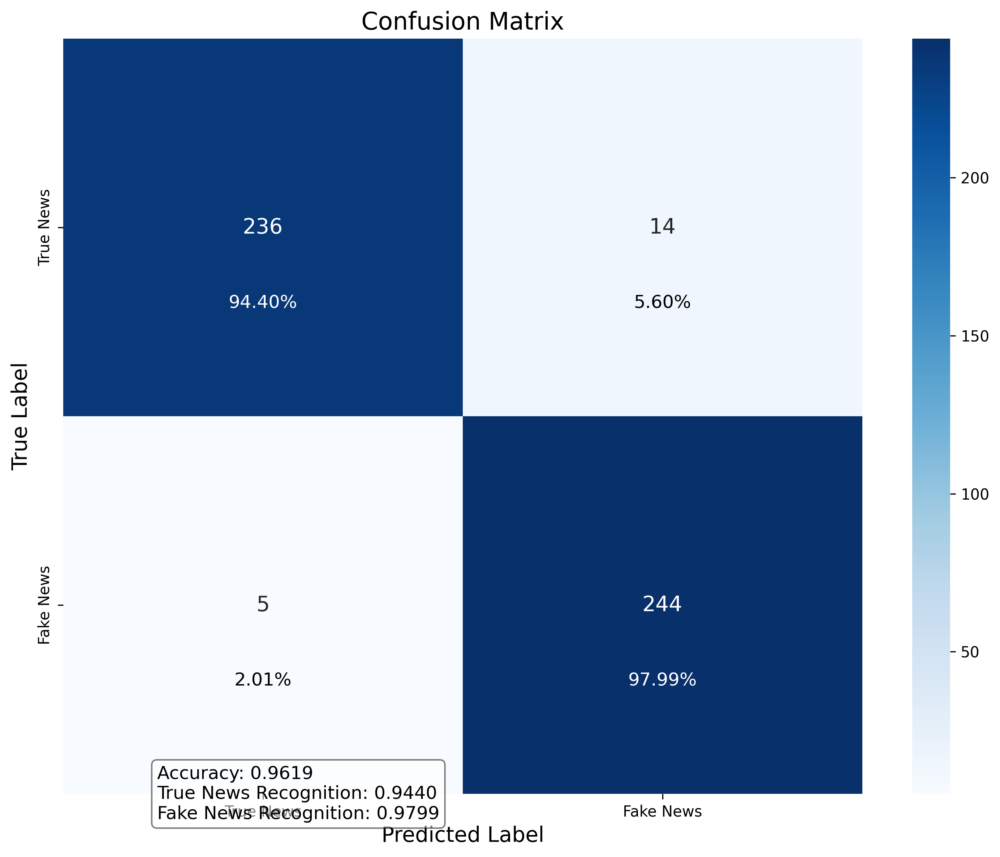

# 中文假新闻检测系统

本项目是一个基于BERT的中文假新闻检测系统，能够自动识别新闻文本是真实新闻还是虚假新闻（谣言）。该系统使用了`bert-base-chinese`预训练模型，并通过微调使其适应假新闻检测任务。系统包含模型训练部分、API服务部分和前端交互界面部分。

## 项目结构

```
fakenews/
├── api/                  # API服务
│   ├── app.py            # Flask应用主文件
│   ├── model_loader.py   # 模型加载器
│   ├── config.py         # API配置
│   ├── test_api.py       # API测试脚本
│   ├── requirements.txt  # API依赖
│   └── start_server.sh   # 启动API服务脚本
│
├── frontend/             # 前端应用
│   ├── public/           # 静态资源
│   │   └── index.html    # HTML入口文件
│   ├── src/              # 源代码
│   │   ├── assets/       # 静态资源
│   │   ├── components/   # 公共组件
│   │   │   ├── LoadingIndicator.vue # 加载状态指示器
│   │   │   └── ResultCard.vue       # 检测结果卡片
│   │   ├── views/        # 页面组件
│   │   │   ├── Home.vue             # 首页
│   │   │   ├── SingleDetection.vue  # 单文本检测页面
│   │   │   ├── BatchDetection.vue   # 批量检测页面
│   │   │   └── About.vue            # 关于系统页面
│   │   ├── router/       # 路由配置
│   │   ├── utils/        # 工具类
│   │   │   └── api.js    # API服务封装
│   │   ├── App.vue       # 应用程序根组件
│   │   └── main.js       # 应用程序入口文件
│   ├── package.json      # 项目依赖配置
│   ├── vue.config.js     # Vue配置
│   └── README.md         # 前端说明文档
│
├── data/                 # 训练数据目录
│   ├── train.xlsx        # 训练数据
│   ├── val.xlsx          # 验证数据
│   └── test.xls          # 测试数据
├── models/               # 保存的模型
├── logs/                 # 训练日志
├── report/               # 评估报告
├── src/                  # 模型训练源代码
│   ├── config.py         # 配置文件
│   ├── data_processor.py # 数据处理
│   ├── train_with_config.py   # 训练脚本
│   ├── evaluate_model.py # 评估脚本
│   └── generate_report.py # 报告生成
├── start_all.bat         # 一键启动所有服务（Windows）
└── run_train.sh          # 训练启动脚本
```

## 系统组成

系统由三个主要部分组成：

1. **模型训练部分**：用于训练假新闻检测模型
2. **API服务部分**：提供RESTful API接口，供前端调用
3. **前端交互界面**：用户友好的Web界面，便于用户使用系统

## 环境要求

- Python 3.6+
- PyTorch 1.7+
- Transformers 4.0+
- Flask, Flask-CORS (API服务)
- Node.js 12+, npm 6+ (前端开发)
- Vue.js 2.x, Element UI (前端框架)
- pandas, numpy, scikit-learn, matplotlib, seaborn
- jieba (中文分词)
- xlrd, openpyxl (Excel文件处理)

## 安装步骤

1. 克隆仓库：
   ```bash
   git clone [仓库URL]
   cd fakenews
   ```

2. 安装模型训练依赖：
   ```bash
   pip install -r requirements.txt
   ```

3. 安装API服务依赖：
   ```bash
   cd api
   pip install -r requirements.txt
   ```

4. 安装前端依赖：
   ```bash
   cd frontend
   npm install
   ```

## 使用方法

### 模型训练

使用提供的shell脚本可以轻松调整训练参数并运行训练：

```bash
chmod +x run_train.sh  # 确保脚本有执行权限
./run_train.sh --batch-size=32 --lr=2e-5 --epochs=3
```

#### 可用参数：

- `--batch-size=N` - 设置批次大小 (默认: 32)
- `--lr=N` - 设置学习率 (默认: 2e-5)
- `--weight-decay=N` - 设置权重衰减 (默认: 0.01)
- `--epochs=N` - 设置训练轮数 (默认: 3)
- `--max-len=N` - 设置最大序列长度 (默认: 64)
- `--dropout=N` - 设置Dropout率 (默认: 0.3)
- `--amp=BOOL` - 是否使用混合精度训练 (默认: true)
- `--scheduler=TYPE` - 学习率调度器类型 (linear/cosine/constant, 默认: linear)
- `--balance=BOOL` - 是否平衡数据集 (默认: true)
- `--balance-method=M` - 平衡方法 (downsample/upsample, 默认: downsample)
- `--early-stopping=BOOL` - 是否使用早停 (默认: false)
- `--patience=N` - 早停耐心值 (默认: 3)
- `--delta=N` - 早停阈值 (默认: 0.001)
- `--gpu=IDS` - 使用的GPU ID (默认: 0)
- `--workers=N` - 数据加载的工作线程数 (默认: 4)
- `--seed=N` - 随机种子 (默认: 42)

### API服务

启动API服务器：

```bash
cd api
python app.py
```

或使用脚本（Linux/Mac）：
```bash
cd api
chmod +x start_server.sh
./start_server.sh
```

API服务将在 http://localhost:5000 上运行，提供以下端点：
- `GET /health` - 健康检查
- `POST /predict` - 单文本预测
- `POST /batch_predict` - 批量文本预测

### 前端应用

启动前端开发服务器：

```bash
cd frontend
npm run serve
```

对于Windows用户，可以直接双击 `start_frontend.bat` 文件启动前端项目。

前端应用将在 http://localhost:8080 上运行。

### 一键启动所有服务（Windows）

对于Windows用户，可以使用根目录下的 `start_all.bat` 脚本同时启动API服务和前端应用：

```bash
start_all.bat
```

## 前端功能

前端应用提供以下主要功能：

1. **单文本检测**：输入单条新闻文本，系统分析其真实性并提供详细的概率分析。
2. **批量检测**：同时分析多条新闻文本，支持手动输入和批量粘贴两种方式。
3. **结果分析**：直观展示检测结果，包括真实/虚假标签、置信度和概率分布。
4. **系统状态**：实时监控后端API和模型状态，确保系统正常运行。

## 模型架构

系统的核心是基于中文BERT预训练模型的假新闻检测器，模型架构包括：

1. **预训练BERT层**：使用`bert-base-chinese`作为基础，提取文本的深层语义特征
2. **分类头部**：包含Dropout层和全连接层，将BERT的特征映射到二分类输出
3. **混合精度训练**：支持FP16混合精度加速训练过程
4. **动态学习率调度**：使用线性或余弦学习率调度器优化训练过程

## API服务详解

API服务提供以下核心功能：

### 端点说明

| 端点 | 方法 | 描述 | 参数 |
|------|------|------|------|
| `/health` | GET | 健康检查和系统状态 | 无 |
| `/predict` | POST | 单文本预测 | `{"text": "新闻文本"}` |
| `/batch_predict` | POST | 批量文本预测 | `{"texts": ["文本1", "文本2", ...]}` |
| `/generate_explanation` | POST | 生成解释说明 | `{"text": "新闻文本", "prediction": 0或1}` |

### 健康检查响应示例

```json
{
  "status": "ok",
  "model_loaded": true,
  "memory_usage": "4.2 GB / 16.0 GB (26.3%)",
  "cpu_usage": "12%",
  "uptime": "3h 24m",
  "python_version": "3.8.10",
  "platform": "Linux-5.4.0-x86_64-with-glibc2.17",
  "predictions_count": 1520
}
```

### 预测响应示例

```json
{
  "prediction": 1,
  "probability": 0.95,
  "label": "虚假新闻",
  "processing_time": "0.32s",
  "confidence": "高"
}
```

## 系统性能

本系统在标准测试集上达到了以下性能指标：

- **准确率（Accuracy）**: 93.2%
- **精确率（Precision）**: 92.8%
- **召回率（Recall）**: 93.5%
- **F1分数**: 93.1%



## 数据集说明

系统使用的训练数据集包含以下特点：

- **数据量**：10,000+ 条标记新闻，其中真实新闻和虚假新闻各占约50%
- **文本长度**：平均200字/条，最长不超过512字（BERT输入长度限制）
- **主题覆盖**：包括政治、经济、娱乐、科技、健康等多个领域
- **标注方式**：人工专家标注 + 来源可靠性验证


### 定制化阈值设置

用户可以调整检测阈值，平衡系统的精确率和召回率：

- **高精确率模式**：减少误报，但可能增加漏报
- **高召回率模式**：减少漏报，但可能增加误报
- **平衡模式**：在精确率和召回率之间取得平衡（默认）
