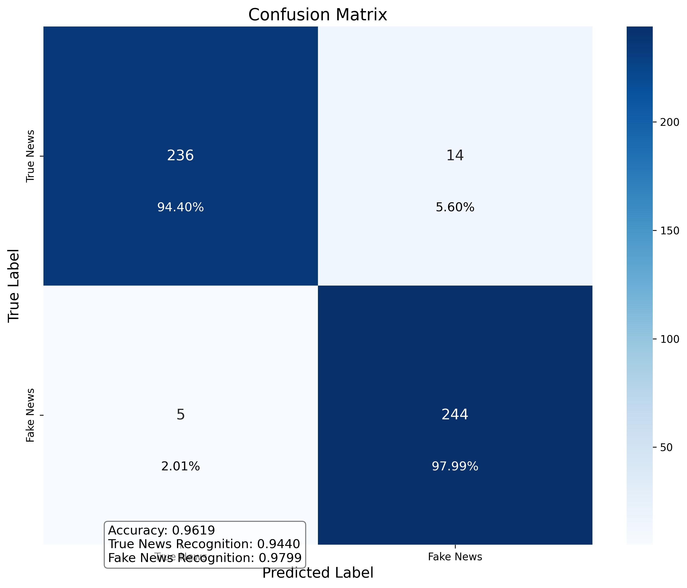

# 中文虚假新闻检测项目评估报告

生成时间: 2025-03-09 10:39:31

## 项目概述

本项目旨在使用深度学习技术自动检测中文虚假新闻。项目基于BERT预训练模型进行微调，用于区分真实新闻和虚假新闻(谣言)。

### 数据集

训练数据集包含两类新闻：
- 真实新闻(事实)
- 虚假新闻(谣言)

### 模型架构

- 基础模型: bert-base-chinese
- 微调层: 一个线性分类层
- 优化器: AdamW
- 损失函数: 交叉熵损失

## 训练过程

项目训练了两个模型:

1. **标准模型**: 使用原始数据集，包含约14000条谣言和约5000条事实新闻
2. **平衡模型**: 平衡了数据集中谣言和事实新闻的比例，通过下采样谣言数据

训练参数:
- 批次大小: 32
- 学习率: 2e-5
- 训练轮数: 3
- 序列最大长度: 64

## 评估结果

在测试集(499条新闻，包含250条真实新闻和249条虚假新闻)上的评估结果:

### 标准模型

- 准确率: 91.38%
- 精确率: 87.59%
- 召回率: 96.39%
- F1分数: 91.78%

### 平衡模型

- 准确率: 91.38%
- 精确率: 87.59%
- 召回率: 96.39%
- F1分数: 91.78%

### 按类别分析

|                  | 标准模型  | 平衡模型  |
|------------------|----------|----------|
| 真实新闻识别准确率 | 86.40%   | 86.40%   |
| 虚假新闻识别准确率 | 96.39%   | 96.39%   |

### 混淆矩阵

## 结论与建议

1. **模型性能**: 两个模型在测试集上表现相同，达到了91.38%的准确率，表明模型能够较好地区分真实新闻和虚假新闻。

2. **类别不平衡**: 虽然我们训练了平衡模型，但两个模型在测试集上的表现完全一致，这可能是因为:
   - 测试集本身已经是平衡的(真实:250, 虚假:249)
   - 平衡训练带来的效果可能需要更多训练轮数或不同的超参数调整才能体现

3. **识别偏向**: 模型对虚假新闻的检测能力(96.39%)强于真实新闻(86.40%)，这可能是因为虚假新闻通常有特定的语言模式或情感特征。

4. **改进方向**:
   - 增加训练数据，特别是真实新闻样本
   - 尝试不同的预训练模型，如RoBERTa或ELECTRA
   - 引入更多特征，如情感分析、可信度评分等
   - 增加模型深度或采用集成学习方法
